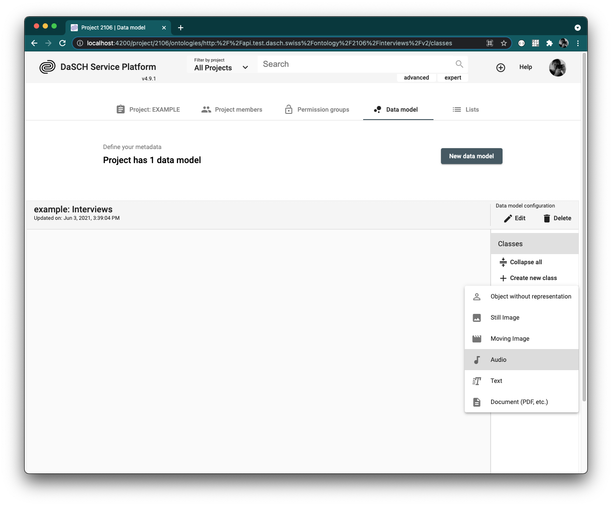
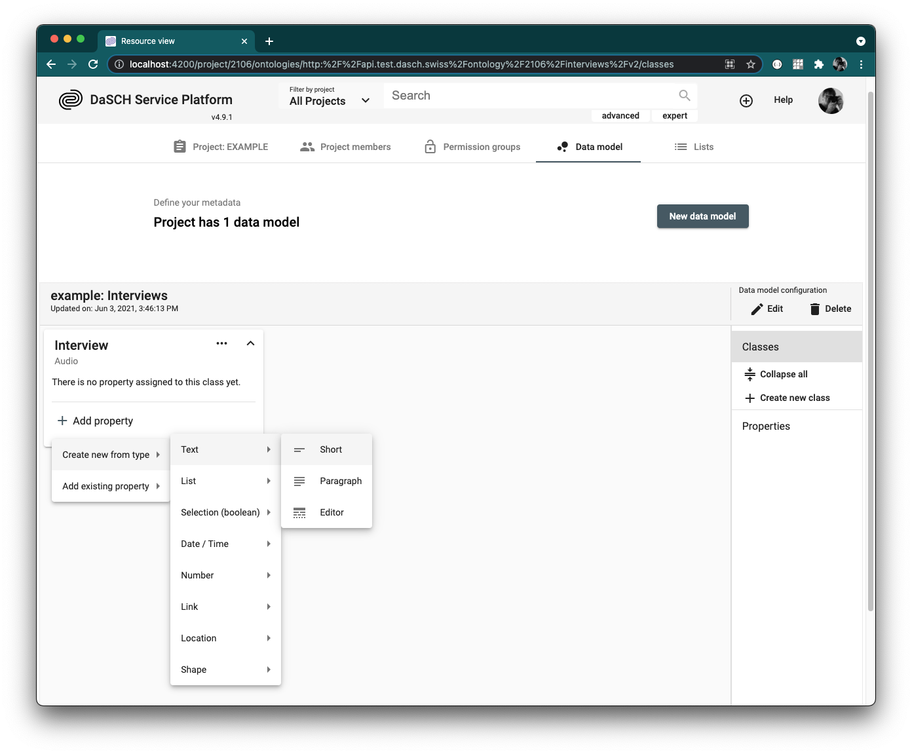
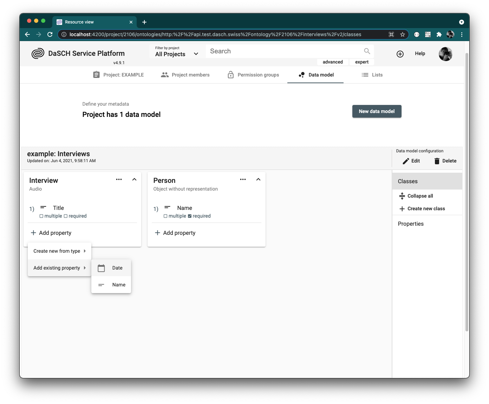
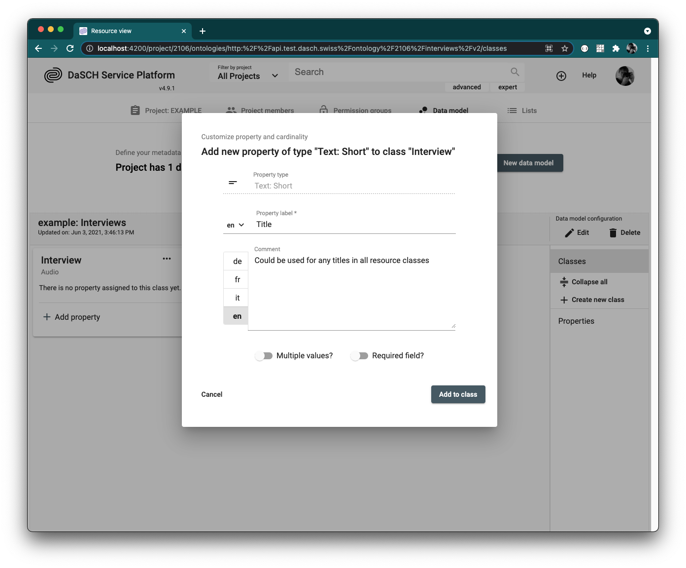
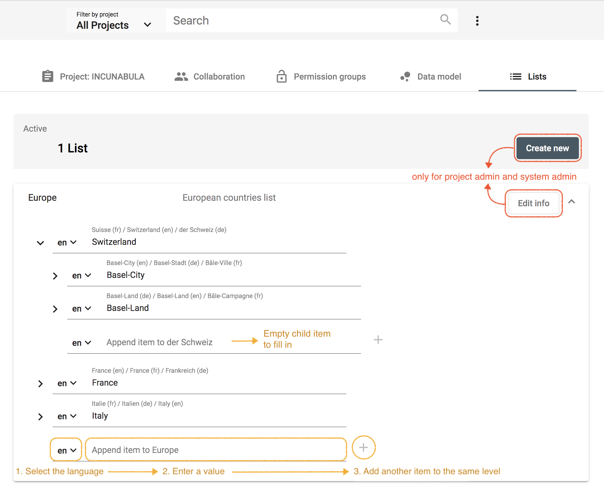

# Project Administration

## Project

Once you are [logged in](/user-guide/#login), the dashboard displays the list of your project(s). If you are a project administrator or a system administrator, you can edit the project information or archive your project from the project menu. Archived projects are stored in a list on your dashboard and they can be "reactivated" at any time.

*<https://admin.dasch.swiss/dashboard> - By clicking on the project name, you get access to the full project information.*

System administrator can create your new research project. Essential information are required such as the project name, a short project description and institution information.

*Form to create a new project.*

As project administrator or system administrator, you can define your project, add your team members, create permission groups and as most important, define your data model (ontology) and the lists of your project.

*<https://admin.dasch.swiss/project/0803/info> - Project management functionalities; e.g. Incunabula project. Project information page is displayed without restricted content, the other functionalities are reserved for project admin and system admin.*

---

## Collaboration

As system admin, you can add users as project member and define their permissions roles: *Who is able to edit or to see data in the project?* Data includes the research sources and their metadata. [Permissions](/user-guide/project/#permission-groups) can be set for the entire project or for single metadata fields. 

A user menu with different actions is accessible for each member of the project (link to the right side of the user line). The admin can appoint another user as project admin (or remove this permission), edit user's information, change user's password if forgotten, and remove a user.

*<https://admin.dasch.swiss/project/0803/collaboration> - Collaboration page where project admin and system admin can add new user to the team.*

> **_NOTE:_** **Permissions for project admins to add new users as project member will be implemented soon.**

---

## Permission groups
&#9888; *NOT YET IMPLEMENTED*

Project admin can create one or several permission groups in their project to set specific permissions on data to a user group.

---

## Data model

The most important step in the project is the definition of the data model. DSP-APP will provide a tool for easy creation of data models. First, you have to know which data and sources you want to work with. The data model can be flexible and customizable. With DSP-APP, you can comply with the FAIR data standard, but compliance is not required to analyze your data.

The questions to answer in creating your data model:

- *What kind of data do I have in my project?*
- *What are the sources and what are their metadata?*

**For example:** You have interviewed 20 people. During these interviews that you recorded, you talked about photographs. Among all the data collected during the project, the most important are:

- audio-files of the interview
- transcribed text of conversations (or transcribe the files within the web application)
- photographs
- data about the person you interviewed
- location where the photograph was taken

Diagram 1 shows the relationships of the data by resource classes from these experiences.

*Relationship of the data by resource classes*

### Create your data model

Go to your project, select the tab `Data model` and click on button `New data model` or `Create your first data model` (in case of a brand new project). This will open a form in a dialog box where you have to set a unique name and a label. Optional you can also add a short description of form of a comment.

> **_NOTE:_** There are some rules for the unique name:
>
> - must be at least 3 characters long
> - shouldn't begin with a number
> - shouldn't begin with the letter v and a number
> - spaces or special characters are not allowed
> - the term "ontology" is not allowed
> - the unique name can't be changed afterwards

The label is a combination of project's shortname and the unique name. You can replace with any other string.

*Data model editor | Step 1: Start by creating a new data model.*

---

### Create the resource CLASSES

In the data model editor, you create your resource classes by selecting a default representation type from a predefined list on the right-hand side. 

Click on `+ Create new class` and select a representation type for your resource class.

*Data model editor | Step 2: Create all your main resource classes by selecting a predefined representation type; e.g. for a taped interview, select the representation type "Audio / Sound / Interview".*

In our example with the interview and the photographs, you drag and drop the following main resource classes from the list on the right-hand side:

- Audio / Sound / Interview
- Transcript
- Image / Photograph / Postcard
- Person
- Location / Place

---

### Select or create the PROPERTIES for each resource class

<!-- TODO: nice idea, but not yet implemented >>> The predefined resource classes offer a suggested list of metadata fields. This list could help to create a data model simply and quickly. It's also possible to deselect the suggested metadata fields (e.g., no metadata), to adapt others and to customize them. -->

There are two possibilites to add properties to a resource class:

#### Create new property by selecting from list of default property types

*Data model editor | Step 3: Add properties to your resource class by selecting from list of default property types.*

#### Select from list of existing properties

If you have already created some properties in another resource classes or in the property section <!-- TODO: add link to property section as soon this section exists --> you can select one of them to add it to the resource class. This way you have to define — for example — a "Title" property only once.

*Data model editor | Step 3: Add properties to your resource class by selecting from list of already existing properties*

In both cases it will open the property form where you have to define a label and optional a comment. If you have selected an existing property, you can also change the label and comment. Be careful in this case, because it can have an effect on other resource classes that use the same property! 

The property type can't be changed here. Depending on the property type you have to set additional attributes, e.g. in a resource link property you have to select a resource class to which the property will point to. Similar in case of a list property where you have to select the corresponding list. In both cases a the linked resource class or the list should already exist.

*Data model editor | Step 4: Define property's label and comment and set the cardinality corresponding to the resource class.*

For each property in a resource class you can define some rules. For example you can define if one of the property can have `multiple` values or if a property is a mandatory (`requiered`) field.

After adding more than one property to a resource class you can change the displayed order by drag'n'drop the properties in the list.

<!--- TODO: add definition for each property type and maybe also for the representation type

### Connect SOURCE TYPES in the data model (optional)

If you have reusable metadata value in a resource type (A), you should create an additional resource type (B) and drag-and-drop it over the metadata field of the first resource type (A) to connect the two data types.
E.g., For the metadata "Photographer" in resource type "Photograph", you should create a resource type "Person" and connect it in "Photograph".

*Data model editor 4: Manage connections between the resource classes.*

---

## Lists
&#9888; *WORK IN PROGRESS*

Projects often need to define lists or hierarchies of categories that can be assigned to many different sources. Lists can be created by project admin and system admin. 

*https://app2.dasch.swiss/project/0803/lists - Project lists: create a new list, add items by selecting the language and enter the corresponding value, repeat for each translation and press the + sign to create another item to the same level.*

**The edition of items and child items will be implemented in a later version.**
-->
